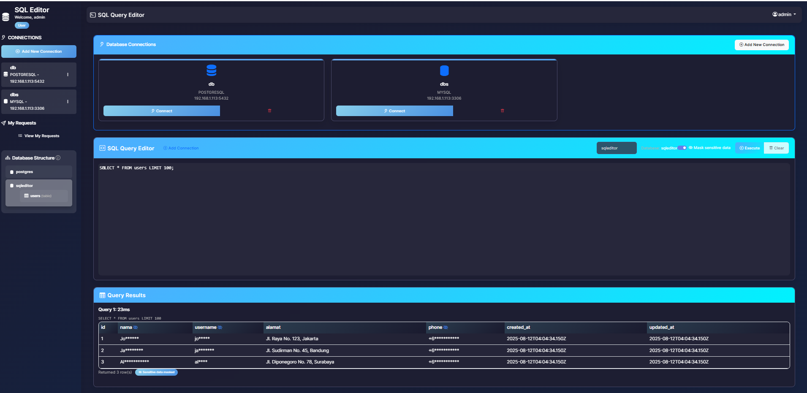
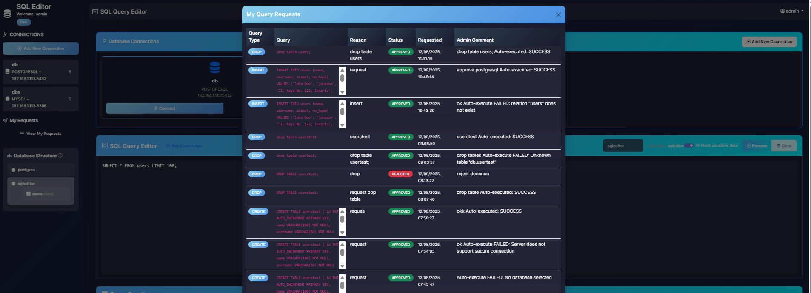

# SQL Editor - MariaDB & PostgreSQL Admin Tool

SQL Editor adalah aplikasi web untuk mengelola database MariaDB/MySQL dan PostgreSQL, mirip dengan phpMyAdmin atau pgAdmin.

## Demo Screenshots

### Query Editor & Results Masking PII 


### Request and Approval


## Fitur

- 🔐 Autentikasi user (data referensi di MariaDB)
- 🗄️ Koneksi ke MariaDB/MySQL dan PostgreSQL
- 📊 Lihat daftar database dan tabel
- ⚡ Eksekusi query SQL
- 🛡️ Masking otomatis data sensitif
- 🎨 Interface web yang user-friendly
- 📱 Responsive design

## Data Security & Masking

Aplikasi ini secara otomatis menyamarkan data sensitif dalam hasil query untuk melindungi informasi pribadi. Kolom yang di-mask meliputi:

- **Nama**: nama, name
- **Email**: email, mail
- **Telepon**: phone, telepon, hp
- **Password**: password, pass
- **Token**: token, secret, key
- **Identitas**: nik, ktp, passport
- **Kartu**: credit_card, card_number

Fitur masking dapat diaktifkan/dinonaktifkan menggunakan toggle di query editor.

## Instalasi

1. Clone repository
2. Install dependencies:
   ```bash
   npm install
   ```

3. Setup environment variables:
   ```bash
   cp .env.example .env
   ```

4. Edit file `.env` dengan konfigurasi database Anda

5. Jalankan aplikasi:
   ```bash
   npm install
   npm start
   ```

6. Akses aplikasi di `http://localhost:3000`

## Aplikasi siap digunakan:
🌐 **URL**: http://localhost:3000
👤 **Login Admin**: admin / admin123
👤 **Login User**: user / user123

## Konfigurasi

Edit file `.env` untuk mengatur koneksi database:

```
# Server Configuration
PORT=3000
SESSION_SECRET=your-secret-key-here

# MariaDB Configuration (untuk data referensi)
MYSQL_HOST=localhost
MYSQL_PORT=3306
MYSQL_USER=root
MYSQL_PASSWORD=
MYSQL_DATABASE=sql_editor_users

# Default Database Connections
DEFAULT_MARIADB_HOST=localhost
DEFAULT_MARIADB_PORT=3306
DEFAULT_POSTGRES_HOST=localhost
DEFAULT_POSTGRES_PORT=5432
```

## Penggunaan

1. Buka browser dan akses `http://localhost:3000`
2. Login atau register akun baru
3. Pilih jenis database (MySQL/PostgreSQL)
4. Masukkan kredensial database
5. Mulai mengelola database Anda!

## Docker Deployment

### Option 1: Docker Compose (Recommended)

1. **Deploy dengan satu command:**
   ```bash
   docker-compose up -d
   ```

2. **Akses aplikasi:**
   - URL: http://localhost:3000
   - Admin: `admin` / `admin123`
   - User: `user` / `user123`

3. **Stop aplikasi:**
   ```bash
   docker-compose down
   ```

4. **View logs:**
   ```bash
   docker-compose logs app
   docker-compose logs mariadb
   ```

### Option 2: Manual Docker Build

1. **Build image:**
   ```bash
   docker build -t sqleditor .
   ```

2. **Run MariaDB:**
   ```bash
   docker run -d \
     --name sqleditor-mariadb \
     -e MYSQL_ROOT_PASSWORD= \
     -e MYSQL_ALLOW_EMPTY_PASSWORD=yes \
     -e MYSQL_DATABASE=sql_editor_users \
     -p 3306:3306 \
     -v sqleditor-mariadb-data:/var/lib/mysql \
     mariadb:10.11
   ```

3. **Run Application:**
   ```bash
   docker run -d \
     --name sqleditor-app \
     --link sqleditor-mariadb:mariadb \
     -e MYSQL_HOST=mariadb \
     -e MYSQL_DATABASE=sql_editor_users \
     -p 3000:3000 \
     sqleditor
   ```

### Docker Environment Variables

```bash
# Application
PORT=3000
SESSION_SECRET=your-secure-secret-here
JWT_SECRET=your-jwt-secret-here

# MariaDB Connection
MYSQL_HOST=mariadb
MYSQL_PORT=3306
MYSQL_USER=root
MYSQL_PASSWORD=
MYSQL_DATABASE=sql_editor_users

# Default Connections
DEFAULT_MARIADB_HOST=mariadb
DEFAULT_MARIADB_PORT=3306
```

### Production Deployment

1. **Clone repository:**
   ```bash
   git clone <repository-url>
   cd sqleditor
   ```

2. **Create production environment:**
   ```bash
   cp .env.example .env.production
   # Edit .env.production with secure secrets
   ```

3. **Deploy:**
   ```bash
   docker-compose -f docker-compose.yml --env-file .env.production up -d
   ```

4. **SSL/HTTPS Setup (with reverse proxy):**
   ```nginx
   server {
       listen 80;
       server_name yourdomain.com;
       
       location / {
           proxy_pass http://localhost:3000;
           proxy_set_header Host $host;
           proxy_set_header X-Real-IP $remote_addr;
       }
   }
   ```

## Teknologi

- **Backend**: Node.js, Express.js
- **Database**: MariaDB/MySQL2, PostgreSQL (pg)
- **Frontend**: EJS, Bootstrap, jQuery
- **Security**: bcryptjs, jsonwebtoken, helmet

## License

MIT
